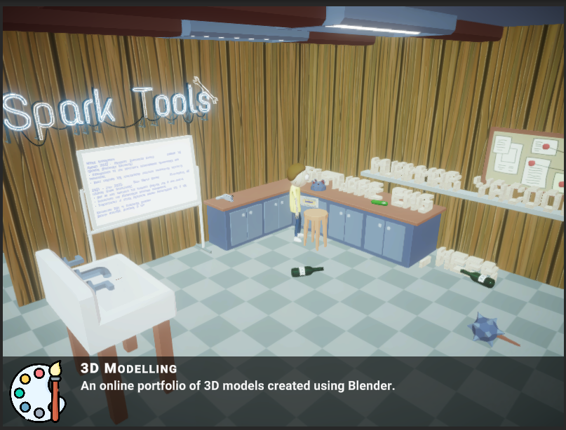

# Interactive 3D Portfolio

<p>Designed for Game Developers and 3D Artists, this project enables showcasing skills in a dynamic 3D environment. Easily embedded into personal websites, it requires only modifications to the `CV.json` file for customization, dynamically rendering your professional details in 3D. <a href="https://muammar-yacoob.github.io/InteractivePortfolio3D/"> Here's a sample</a> without your customizations.</p>

## Setup

### Fork the Repository
- Use the 'Fork' button on GitHub to create your copy for customization and updates.

### Customize Your CV
- Edit the `CV.json` in `Assets/StreamingAssets` with your details. Example format:
  ```json
  {
    "Name": "Your Name",
    "JobTitle": "Your Job Title",
    ...
    "Projects": [
      {
        "Title": "Project Title",
        ...
      }
    ]
  }
  ```
### Setup GitHub Pages
Publish with GitHub Pages: In your forked repository's settings, navigate to "Pages" and select your main branch as the source. GitHub will provide a URL to access your project online.
### Embed in Your Website:
```html
<iframe src="https://yourusername.github.io/your-repository-name/" width="960" height="540" allowfullscreen="allowfullscreen"></iframe>
```
Replace the src with your GitHub Pages URL. Adjust width and height as needed.

## Contribution
Contributions are welcome! Fork, modify, and submit a pull request.
A star ⭐ to the repo is much appreciated.

## Credits
Artwork
- Morty: https://skfb.ly/ownJQ
- Whiteboard: https://skfb.ly/orOsB
- Tape: https://skfb.ly/6YWop
- Icons: https://www.flaticon.com/